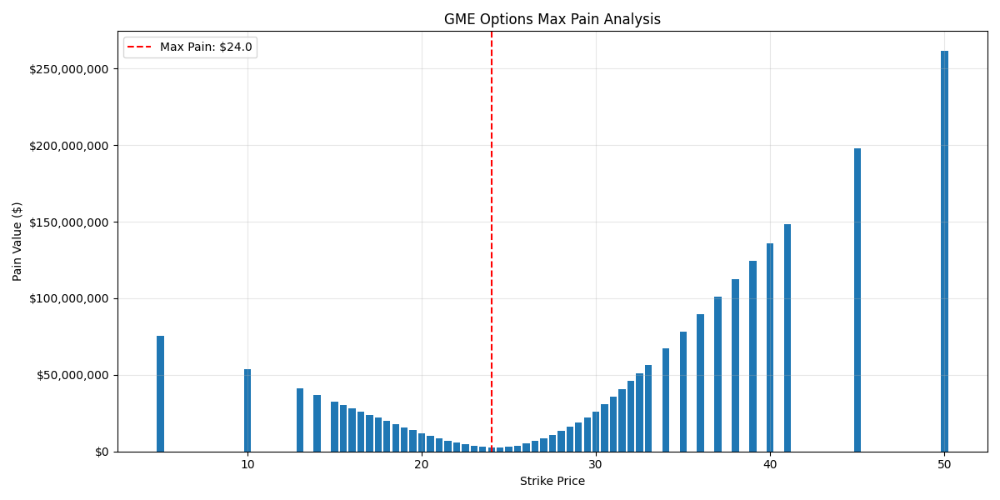
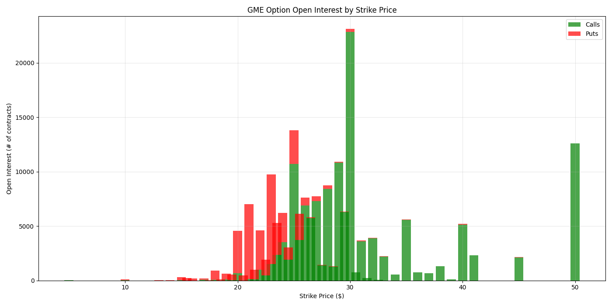
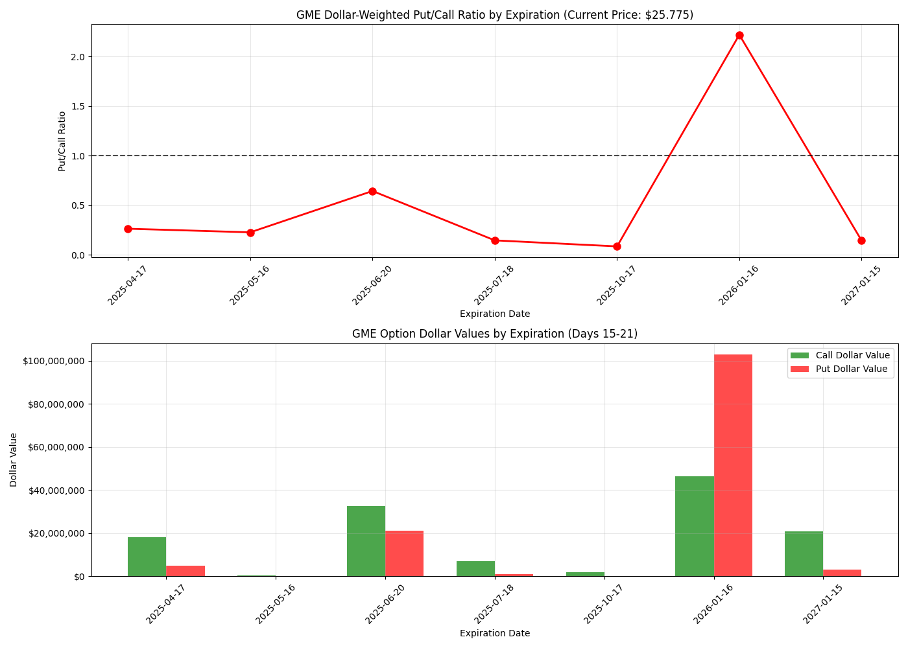

# Options Analysis Tool

A comprehensive Python tool for analyzing stock options data, calculating various metrics, and generating visualizations to assist with options trading decisions.

## Features

- **Max Pain Analysis**: Calculate and visualize the price point where option holders experience maximum financial pain
- **Open Interest Distribution**: Analyze the distribution of open interest across different strike prices
- **Dollar-Weighted Put/Call Analysis**: Calculate dollar-weighted put/call ratios for monthly expirations

## Installation

1. Clone this repository
2. Install required dependencies:
```bash
pip install pandas numpy matplotlib schwab-py
```

## Usage

1. Authenticate and fetch options data using the `schwab_auth.py` script:
```bash
python schwab_auth.py
```
2. Run the main script:
```bash
python options-data-tracker.py
```
3. Generated outputs (plots and CSV reports) will be saved to the outputs/ directory

## Data Format

The tool expects options data in JSON format with the following structure:
```json
{
  "symbol": "TICKER",
  "underlyingPrice": 123.45,
  "callExpDateMap": { ... },
  "putExpDateMap": { ... }
}
```

## Visualizations

### Max Pain Analysis

The max pain chart shows the point where option writers would cause maximum financial loss to option buyers if the stock expired at that price.



### Open Interest Distribution

This visualization shows the distribution of open interest across different strike prices for both calls and puts.



### Dollar-Weighted Put/Call Analysis

This analysis examines the dollar-weighted put/call ratio across different expirations, providing insights into market sentiment.



## Code Structure

The code is organized into four main classes:

1. **OptionsData**: Handles loading and providing access to options data
2. **OptionAnalyzer**: Performs analysis calculations on the data
3. **OptionsVisualizer**: Handles visualization and plotting
4. **OptionsReport**: Generates and displays formatted reports

## Example Output

Running the script produces terminal output with analysis results:

```
Analyzing options data for SYMBOL...
Max Pain Strike: $XXX.X

Pain values around max pain:
   Strike    |   Pain Value    
----------------------------
 $XXX.X     | $XXX,XXX     
 $XXX.X     | $XXX,XXX     
 $XXX.X     | $XXX,XXX      (MAX PAIN)
 $XXX.X     | $XXX,XXX     
 $XXX.X     | $XXX,XXX     

SYMBOL Dollar-Weighted Put/Call Analysis (Current Price: $XXX.XX)
Filtered for expirations on days 15-21 of the month
====================================================================================================
Expiration  Call Dollar Value   Put Dollar Value    Total Dollar Value  Dollar-Weighted P/C Ratio
2023-XX-XX    $XXX,XXX.XX        $XXX,XXX.XX         $X,XXX,XXX.XX             X.XXXX
2023-XX-XX    $XXX,XXX.XX        $XXX,XXX.XX         $X,XXX,XXX.XX             X.XXXX
TOTAL         $XXX,XXX.XX        $XXX,XXX.XX         $X,XXX,XXX.XX             X.XXXX
```

## License

MIT

## Contributing

Contributions are welcome! Please feel free to submit a Pull Request.